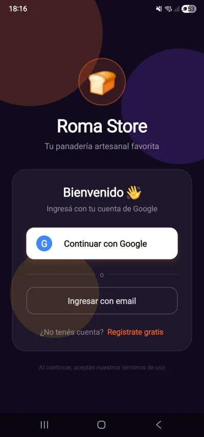
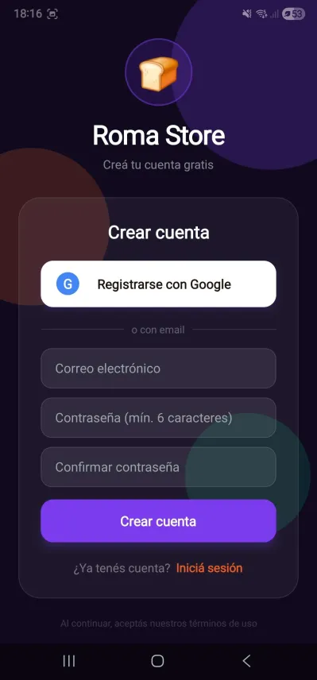
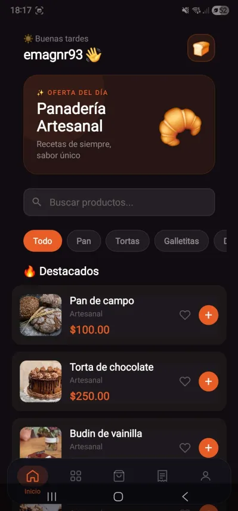
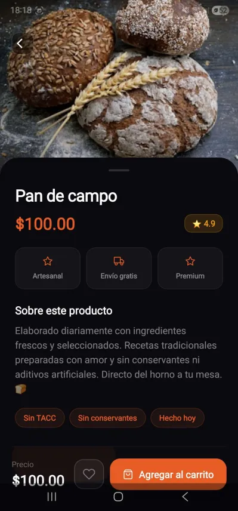
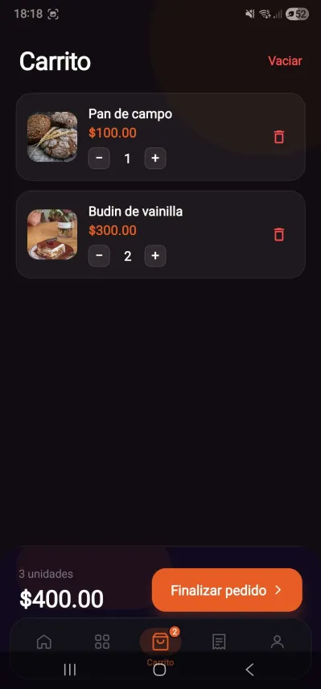
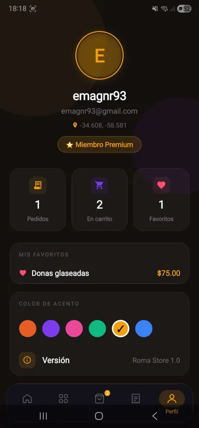

# 🍞 Roma Store

Aplicación móvil de ecommerce para una panadería artesanal, desarrollada con **React Native + Expo**. Diseño premium dark mode, autenticación con Firebase, carrito persistido, favoritos, historial de pedidos y tema dinámico con colores de acento personalizables.

> 📱 Portfolio project — Emanuel Diaz Ochoa

---

## 📸 Screenshots

<div align="center">

| Login | Register | Home |
|:-----:|:--------:|:----:|
|  |  |  |

| Detalle | Carrito | Perfil |
|:-------:|:-------:|:------:|
|  |  |  |

</div>

---

## 🚀 Funcionalidades

- ✅ Login y registro con Firebase Auth (email + Google OAuth)
- ✅ Sesión persistente con SQLite — no requiere login en cada apertura
- ✅ Productos desde Firebase Realtime Database con imágenes reales
- ✅ Carrito con control de cantidades y persistencia local (AsyncStorage)
- ✅ Favoritos persistidos con AsyncStorage
- ✅ Historial de pedidos
- ✅ Filtros por categoría con scroll horizontal
- ✅ Skeleton loaders mientras cargan los productos
- ✅ Notificación local al confirmar pedido
- ✅ Ubicación del usuario en tiempo real
- ✅ Animaciones con React Native Animated API
- ✅ Tab bar personalizado con SVG icons y animaciones
- ✅ Toast animado para feedback de acciones
- ✅ ConfirmModal bottom sheet personalizado
- ✅ Selector de color de acento con 6 opciones (persistido)
- ✅ Sistema de tema dinámico — toda la UI reacciona al color elegido
- ✅ Botón de favorito animado (♥) en cards y pantalla de detalle

---

## 🧰 Stack tecnológico

| Tecnología | Uso |
|---|---|
| React Native + Expo SDK 55 | Base de la app |
| Firebase Auth | Autenticación email y Google |
| Firebase Realtime Database | Catálogo de productos |
| Redux Toolkit | Estado global (carrito, favoritos, pedidos, UI) |
| AsyncStorage | Persistencia de carrito, favoritos y preferencias |
| expo-sqlite | Sesión persistente entre cierres de app |
| expo-notifications | Notificaciones locales al confirmar pedido |
| expo-location | Ubicación del usuario en perfil |
| @react-native-google-signin/google-signin | Google OAuth nativo |
| React Navigation | Navegación stack + tabs |
| react-native-svg | Iconos del tab bar |
| react-native-reanimated | Animaciones avanzadas |
| EAS Build | Build nativo para Android |

---

## ⚙️ Instalación

### Requisitos
- Node.js 18+
- Expo CLI (`npm install -g expo-cli`)
- Cuenta en [Firebase](https://firebase.google.com)
- EAS CLI para builds (`npm install -g eas-cli`)

### Pasos

```bash
# 1. Clonar el repositorio
git clone https://github.com/EmanuelDiazOchoa/mistorecoder
cd mistorecoder

# 2. Instalar dependencias
npm install

# 3. Configurar variables de entorno
cp .env.example .env
# Completar .env con tus credenciales de Firebase

# 4. Iniciar en modo desarrollo
npx expo start --dev-client
```

### Variables de entorno

Crear un archivo `.env` en la raíz:

```env
EXPO_PUBLIC_FIREBASE_API_KEY=
EXPO_PUBLIC_FIREBASE_AUTH_DOMAIN=
EXPO_PUBLIC_FIREBASE_DATABASE_URL=
EXPO_PUBLIC_FIREBASE_PROJECT_ID=
EXPO_PUBLIC_FIREBASE_STORAGE_BUCKET=
EXPO_PUBLIC_FIREBASE_MESSAGING_SENDER_ID=
EXPO_PUBLIC_FIREBASE_APP_ID=
```

### Build nativo (Android)

```bash
# Build de desarrollo (APK para testing)
eas build --profile development --platform android

# Build de producción
eas build --profile production --platform android
```

---

## 🗄️ Estructura de Firebase

Los productos en Realtime Database siguen esta estructura:

```json
{
  "products": {
    "1": {
      "id": 1,
      "name": "Pan de campo",
      "category": "pan",
      "price": 100,
      "image": "https://images.unsplash.com/..."
    }
  }
}
```

**Categorías disponibles:** `pan`, `torta`, `galletitas`, `donas`, `budin`, `chocolate`

**Reglas de seguridad recomendadas:**
```json
{
  "rules": {
    ".read": "auth != null",
    ".write": "auth != null"
  }
}
```

---

## 📁 Estructura del proyecto

```
roma-store/
├── assets/
│   └── screenshots/         # Capturas de pantalla
├── src/
│   ├── components/          # ProductCard, SearchBar, SkeletonCard,
│   │                        # EmptyState, Toast, ConfirmModal
│   ├── features/
│   │   └── auth/            # authSlice
│   ├── hooks/
│   │   └── useTheme.js      # Hook que lee accentColor del store
│   ├── navigation/
│   │   ├── StackNavigator.js
│   │   └── BottomTabNavigator.js  # Tab bar custom con SVG
│   ├── redux/
│   │   ├── store.js
│   │   ├── cartSlice.js
│   │   ├── favoritesSlice.js
│   │   ├── ordersSlice.js
│   │   ├── productsSlice.js
│   │   └── uiSlice.js       # isDark + accentColor
│   ├── screens/
│   │   ├── LoginScreen.js
│   │   ├── RegisterScreen.js
│   │   ├── HomeScreen.js
│   │   ├── CategoriesScreen.js
│   │   ├── CategoryProductsScreen.js
│   │   ├── DetailsScreen.js
│   │   ├── CartScreen.js
│   │   ├── OrdersScreen.js
│   │   └── ProfileScreen.js
│   ├── service/
│   │   ├── firebase.js      # Inicialización Firebase
│   │   └── sessionStorage.js  # SQLite session
│   ├── theme/
│   │   └── index.js         # getTheme(), palette, shadows
│   └── utils/
│       └── productImages.js # Fallbacks locales por categoría
├── App.js
├── app.json
├── eas.json
└── .env.example
```

---

## 🎨 Sistema de temas

La app tiene un sistema de tema dinámico basado en Redux. El usuario puede elegir entre 6 colores de acento desde la pantalla de Perfil, y toda la UI reacciona en tiempo real: botones, chips, tab bar, glows decorativos y badges.

```js
// Colores de acento disponibles
['#E85D26', '#7C3AED', '#EC4899', '#10B981', '#F59E0B', '#3B82F6']
```

El helper `isLightColor()` garantiza legibilidad del texto sobre cualquier acento claro u oscuro.

---

## 🔐 Autenticación

La app soporta dos métodos de login:

- **Email + contraseña** vía Firebase Auth
- **Google OAuth** vía `@react-native-google-signin/google-signin` (flujo nativo Android)

La sesión se persiste en SQLite (`expo-sqlite`) para que el usuario no deba loguearse en cada apertura.

---

## 🗺️ Roadmap

- [x] Fase 1 — MVP: auth, catálogo, carrito, favoritos, pedidos
- [x] Fase 2 — UI premium: dark mode, animaciones, tema dinámico
- [ ] Fase 3 — Pagos: integración Mercado Pago Checkout Pro (sandbox)
- [ ] Fase 4 — Backend: estados de pedido en Firebase, notificaciones push

---

## 👤 Autor

**Emanuel Diaz Ochoa**
[GitHub](https://github.com/EmanuelDiazOchoa) · [LinkedIn](#)

---

## 📄 Licencia

MIT