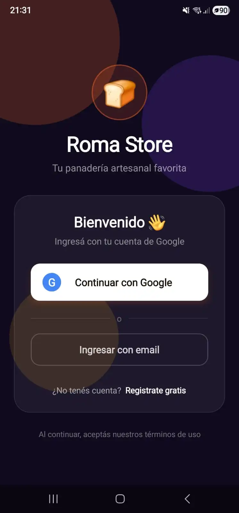
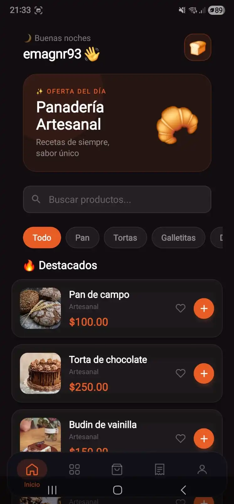
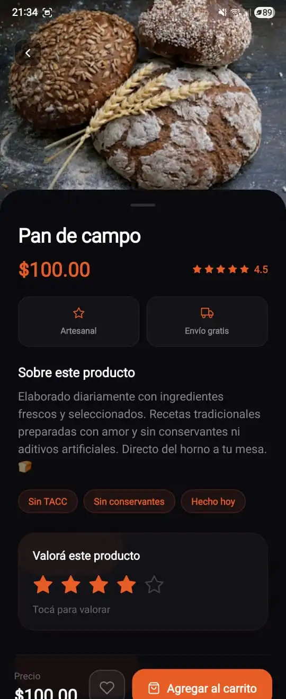
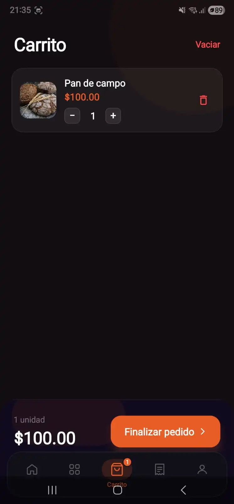
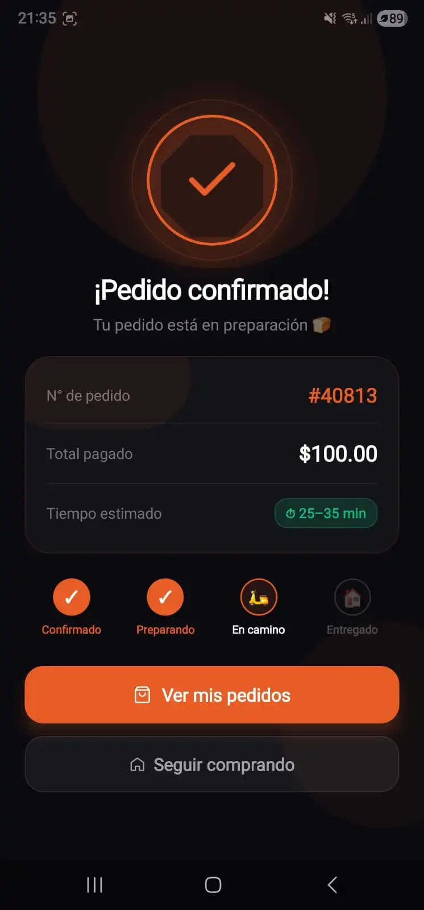
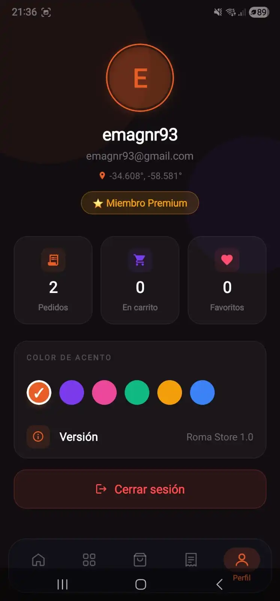

<!-- markdownlint-disable MD033 -->

# 🍞 Roma Store

> Aplicación móvil de ecommerce para una panadería artesanal — Portfolio project

<div align="center">


</div>

---

## 📸 Capturas

<div align="center">

| Login | Home | Detalle |
| :---: | :--: | :-----: |
|  |  |  |

| Carrito | Pedido confirmado | Perfil |
| :------: | :----------------: | :----: |
|  |  |  |

</div>

---

## ✨ Funcionalidades

### 🔐 Autenticación

- Login y registro con **Firebase Auth** (email + contraseña)
- Sesión persistente con **SQLite** — no requiere login en cada apertura

### 🛍️ Catálogo

- Productos en tiempo real desde **Firebase Realtime Database**
- Filtros por categoría con scroll horizontal animado
- Búsqueda en tiempo real
- **Skeleton loaders** durante la carga
- Sistema de valoración con estrellas (persistencia entre sesiones)

### 🛒 Carrito y pedidos

- Carrito con control de cantidades persistido en **AsyncStorage**
- Modal de confirmación animado (bottom sheet)
- Pantalla de éxito animada con número de pedido, total y tiempo estimado
- Simulador de estados del pedido (Confirmado → Preparando → En camino)
- Historial de pedidos

### 👤 Perfil personalizable

- **Nombre editable** — se sincroniza en tiempo real con el saludo del Home
- **Foto de perfil** desde galería con recorte circular y persistencia local
- **Ubicación humana** — reverse geocoding muestra "Buenos Aires, Argentina" en lugar de coordenadas
- Saludo dinámico según hora del día

### 🎨 UI/UX

- Diseño **dark mode premium** con sistema de tema dinámico
- **6 colores de acento** personalizables — toda la UI reacciona en tiempo real
- Tab bar custom con **SVG icons** y animaciones de escala
- Animaciones con **React Native Animated API** (spring, stagger, sequence)
- Toast animado para feedback visual
- Botón de favorito animado con persistencia
- Iconografía SVG sin dependencias de icon fonts

---

## 🧰 Stack tecnológico

| Tecnología | Versión | Uso |
| --- | --- | --- |
| React Native | 0.83.6 | Base de la app |
| Expo SDK | 55 | Toolchain y módulos nativos |
| TypeScript | 5.5 | Tipado estático |
| Firebase Auth | 11 | Autenticación email/contraseña |
| Firebase Realtime DB | 11 | Catálogo de productos |
| Redux Toolkit | 2.8 | Estado global (7 slices) |
| AsyncStorage | 2.2 | Persistencia local |
| expo-sqlite | 55 | Sesión persistente |
| expo-location | 55 | Geolocalización + reverse geocoding |
| expo-image-picker | 55 | Foto de perfil desde galería |
| React Navigation | 7 | Stack + Bottom Tabs |
| react-native-svg | 15 | Iconografía SVG |
| EAS Build | — | Build nativo Android |

---

## 🏗️ Arquitectura

```txt
src/
├── components/
│   ├── ConfirmModal.tsx    # Bottom sheet animado
│   ├── ProductCard.tsx     # Card con animaciones
│   ├── StarRating.tsx      # Sistema de valoración
│   ├── SkeletonCard.tsx    # Loader placeholder
│   └── Toast.tsx           # Feedback animado
├── features/
│   └── auth/authSlice.ts
├── hooks/
│   ├── useRedux.ts         # Typed hooks de Redux
│   └── useTheme.ts         # Hook de tema dinámico
├── navigation/
│   ├── StackNavigator.tsx
│   └── BottomTabNavigator.tsx
├── redux/
│   ├── store.ts
│   ├── cartSlice.ts
│   ├── favoritesSlice.ts
│   ├── ordersSlice.ts
│   ├── productsSlice.ts
│   ├── ratingsSlice.ts     # Valoraciones con persistencia
│   └── uiSlice.ts          # Tema + accentColor + displayName
├── screens/
│   ├── LoginScreen.tsx
│   ├── RegisterScreen.tsx
│   ├── HomeScreen.tsx
│   ├── CategoriesScreen.tsx
│   ├── CategoryProductsScreen.tsx
│   ├── DetailsScreen.tsx
│   ├── CartScreen.tsx
│   ├── OrderSuccessScreen.tsx
│   ├── OrdersScreen.tsx
│   └── ProfileScreen.tsx
├── service/
│   ├── firebase.ts         # Inicialización Firebase
│   └── sessionStorage.ts   # Sesión SQLite
├── theme/index.ts          # getTheme(), palette, isLightColor()
├── types/index.ts          # Tipos globales
└── utils/productImages.ts
```

---

## ⚙️ Instalación

### Requisitos

- Node.js 18+
- Expo CLI — `npm install -g expo-cli`
- EAS CLI — `npm install -g eas-cli`
- Cuenta en [Firebase](https://firebase.google.com)

### Setup

```bash
# 1. Clonar repositorio
git clone https://github.com/EmanuelDiazOchoa/mistorecoder
cd mistorecoder

# 2. Instalar dependencias
npm install

# 3. Configurar variables de entorno
cp .env.example .env
# Completar con tus credenciales de Firebase

# 4. Iniciar proyecto
npx expo start --dev-client
```

### Variables de entorno

```env
EXPO_PUBLIC_FIREBASE_API_KEY=
EXPO_PUBLIC_FIREBASE_AUTH_DOMAIN=
EXPO_PUBLIC_FIREBASE_DATABASE_URL=
EXPO_PUBLIC_FIREBASE_PROJECT_ID=
EXPO_PUBLIC_FIREBASE_STORAGE_BUCKET=
EXPO_PUBLIC_FIREBASE_MESSAGING_SENDER_ID=
EXPO_PUBLIC_FIREBASE_APP_ID=
```

### Build Android

```bash
# APK de desarrollo
eas build --profile development --platform android

# Preview (APK standalone sin Expo Go)
eas build --profile preview --platform android

# Producción
eas build --profile production --platform android
```

---

## 🗄️ Estructura Firebase

```json
{
  "products": {
    "1": {
      "id": 1,
      "name": "Pan de campo",
      "category": "pan",
      "price": 100,
      "image": "https://..."
    }
  }
}
```

### Categorías

`pan` · `torta` · `galletitas` · `donas` · `budin` · `chocolate`

### Reglas recomendadas

```json
{
  "rules": {
    ".read": "auth != null",
    ".write": "auth != null"
  }
}
```

---

## 🎨 Sistema de temas

El usuario elige entre 6 colores de acento desde Perfil. Toda la UI reacciona en tiempo real: botones, tab bar, badges, glows y chips. El nombre editado en Perfil se sincroniza instantáneamente con el saludo del Home via Redux.

```ts
const ACCENT_COLORS = ['#E85D26', '#7C3AED', '#EC4899', '#10B981', '#F59E0B', '#3B82F6'];
```

`isLightColor()` garantiza legibilidad del texto sobre cualquier color de acento.

---

## 🗺️ Roadmap

- [x] MVP — auth, catálogo, carrito, favoritos y pedidos
- [x] UI premium — dark mode, animaciones y SVG icons
- [x] Sistema de valoraciones persistente
- [x] Pantalla de éxito animada con tracking de pedido
- [x] Perfil personalizable — nombre, foto y ubicación humana
- [ ] Integración Mercado Pago Checkout Pro (sandbox)
- [ ] Backend de estados de pedido en Firebase
- [ ] Notificaciones push

---

## 👤 Autor

**Emanuel Diaz Ochoa*

- GitHub: <https://github.com/EmanuelDiazOchoa>
- LinkedIn: <https://linkedin.com/in/emanuel-diaz-ochoa>

---

## 📄 Licencia

MIT © 2025 Emanuel Diaz Ochoa
